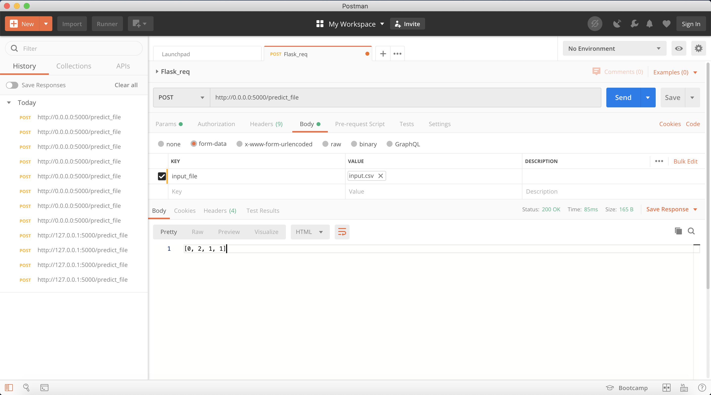

# Machine Learning with Flask

This repository demonstrates the use of REST API with Machine Learning. **Random Forest Classifier** is used to predict species in the iris dataset. Then the model is used as a backend and test samples are fired from input.csv as POST requests via flask REST API.

## Getting Started

Note: Docker should be installed on the local host.

1. Clone the repository.
2. Run:

```
$ docker build -t rf-api
$ docker run -p 5000:5000 rf-api
```

To send the requests: <br>
Use **localhost:5000/apidocs** on your locak system. <br> <br>
Alernatively,<br>
Open **Postman**, connect to the **localhost:5000/predict_file** and POST your request.<br>
The Postman response should look like this: <br>


<br>

The response is [0,2,1,1] which means that the first sample belongs to specie 0 and so on...

## Author
* **Rupali Sinha** - *Initial work*
